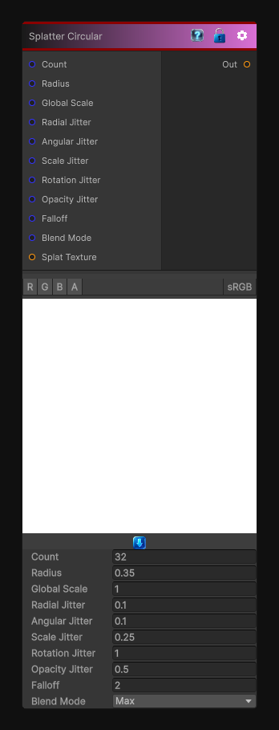

# Splatter Circular

> This file is auto-generated by `Documentation/Generate-GenesisNodeDocs.ps1`.

[Back to index](../../README.md) | [Back to Generators](../../generators.md)

## Snapshot

## Details

- Menu: `Generators/Shapes/Splatter Circular`
- Node group: `Shape`
- Shader: `Hidden/Genesis/SplatterCircular`
- Source: [Runtime/Nodes/Generator/Shape/SplatterCircularNode.cs](../../../../Runtime/Nodes/Generator/Shape/SplatterCircularNode.cs)

## Documentation

Scatters circular shapes across the texture for droplets, bubbles, or patterned masks.
