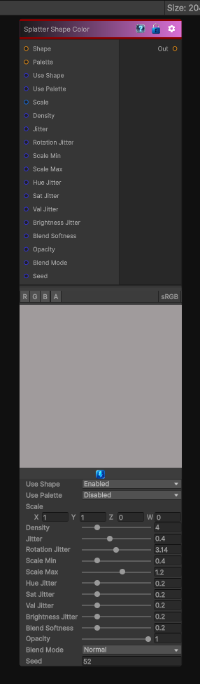

# Splatter Shape Color

> This file is auto-generated by `Documentation/Generate-GenesisNodeDocs.ps1`.

[Back to index](../../README.md) | [Back to Generators](../../generators.md)

## Snapshot

## Details

- Menu: `Generators/Shapes/Splatter Shape Color`
- Node group: `Shape`
- Shader: `Hidden/Genesis/SplatterColor`
- Source: [Runtime/Nodes/Generator/Shape/SplatterShapeColorNode.cs](../../../../Runtime/Nodes/Generator/Shape/SplatterShapeColorNode.cs)

## Documentation

This Splatter Shape Color gives you:
- Per-instance random color
- Optional color palette sampling (via a color map)
- Blend modes (normal, additive, multiply)
- Random hue/sat/value jitter
- Random brightness
- Random opacity
- Fully deterministic, sampler-free except for the shape + optional palette
