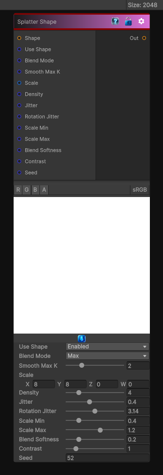

# Splatter Shape

> This file is auto-generated by `Documentation/Generate-GenesisNodeDocs.ps1`.

[Back to index](../../README.md) | [Back to Generators](../../generators.md)

## Snapshot

## Details

- Menu: `Generators/Shapes/Splatter Shape`
- Node group: `Shape`
- Shader: `Hidden/Genesis/ShapeSplatter`
- Source: [Runtime/Nodes/Generator/Shape/SplatterShapeNode.cs](../../../../Runtime/Nodes/Generator/Shape/SplatterShapeNode.cs)

## Documentation

- Scatter many shape instances across a grid
- Per-instance random position, rotation, scale
- Optional jitter, density, falloff, blending
- Deterministic, sampler-free except for the input shape
- CRT-safe, single-pass, no atomics, no loops dependent on texture size
- Perfect for grunge, debris, organic breakup, stylized masks, and pattern generation
