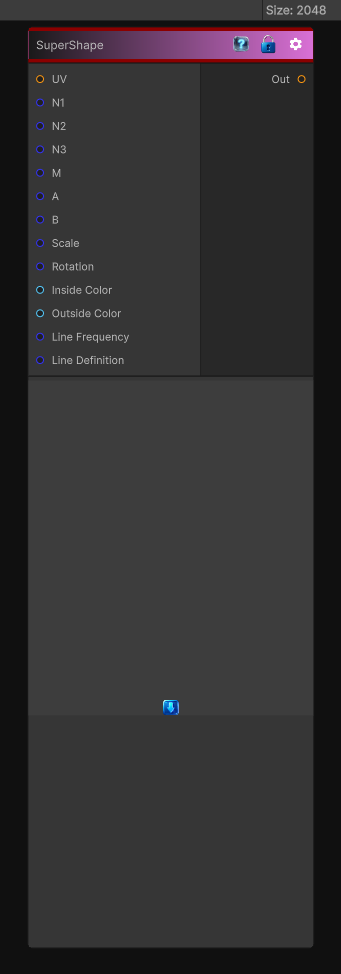

# SuperShape

> This file is auto-generated by `Documentation/Generate-GenesisNodeDocs.ps1`.

[Back to index](../../README.md) | [Back to Generators](../../generators.md)

## Snapshot

## Details

- Menu: `Generators/Shapes/SuperShape`
- Node group: `Shape`
- Shader: `Hidden/Genesis/SuperShape`
- Source: [Runtime/Nodes/Generator/Shape/SuperShapeNode.cs](../../../../Runtime/Nodes/Generator/Shape/SuperShapeNode.cs)

## Documentation

Generates procedural shapes based on the Superformula (Gielis formula).
Works in both 2D and 3D:
- 2D: Creates flat shapes with radial symmetry (flowers, stars, etc.)
- 3D: Generates volumetric shapes by combining two superformulas

Parameters:
- N1, N2, N3: Control shape symmetry and complexity
- M: Number of repetitions/sides
- A, B: Shape scale along axes
- Scale: Overall shape size
- Rotation: Shape orientation
- Inside/Outside Colors: Shape coloring
- Line Frequency/Definition: Control line pattern appearance
