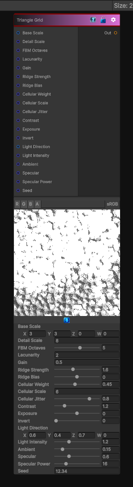

# Triangle Grid

> This file is auto-generated by `Documentation/Generate-GenesisNodeDocs.ps1`.

[Back to index](../../README.md) | [Back to Generators](../../generators.md)

## Snapshot

## Details

- Menu: `Generators/Shapes/Triangle Grid`
- Node group: `Shape`
- Shader: `Hidden/Genesis/TriangleGrid`
- Source: [Runtime/Nodes/Generator/Shape/TriangleGridNode.cs](../../../../Runtime/Nodes/Generator/Shape/TriangleGridNode.cs)

## Documentation

Generates a repeating triangular grid pattern.
