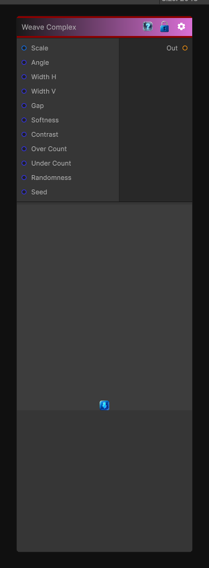

# Weave Complex

> This file is auto-generated by `Documentation/Generate-GenesisNodeDocs.ps1`.

[Back to index](../../README.md) | [Back to Generators](../../generators.md)

## Snapshot

## Details

- Menu: `Generators/Shapes/Weave Complex`
- Node group: `Shape`
- Shader: `Hidden/Genesis/Weave3`
- Source: [Runtime/Nodes/Generator/Shape/WeaveComplexNode.cs](../../../../Runtime/Nodes/Generator/Shape/WeaveComplexNode.cs)

## Documentation

Weave Complex is where things get really interesting - this is the complex twill variant:
2-over-1-under, 3-over-1-under, 4-over-2-under, etc.
In other words:
-> You control how many horizontal threads go over before going under, and vice-versa.
This is how you get denim-style twill, herringbone precursors, carbon-fiber-like diagonals, and stylized woven sci-fi surfaces.
This version is:
- deterministic
- CRT-safe
- sampler-free
- fully modular
