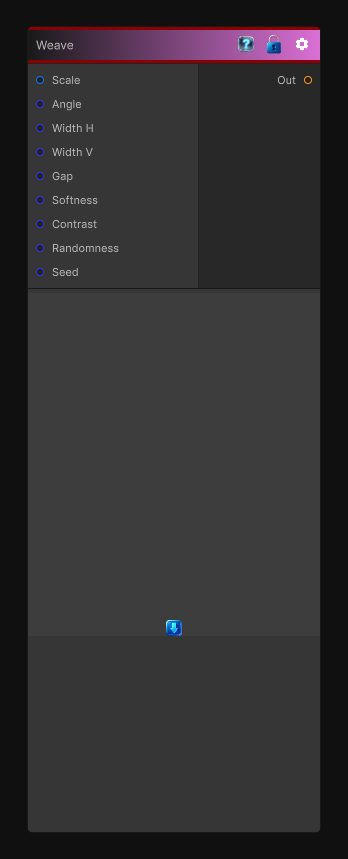

# Weave

> This file is auto-generated by `Documentation/Generate-GenesisNodeDocs.ps1`.

[Back to index](../../README.md) | [Back to Generators](../../generators.md)

## Snapshot

## Details

- Menu: `Generators/Shapes/Weave`
- Node group: `Shape`
- Shader: `Hidden/Genesis/Weave`
- Source: [Runtime/Nodes/Generator/Shape/WeaveNode.cs](../../../../Runtime/Nodes/Generator/Shape/WeaveNode.cs)

## Documentation

This node produces a woven over/under pattern using two perpendicular stripe sets, with:
- adjustable thread width
- adjustable gap
- over/under alternation
- optional random variation
- rotation
- softness
- contrast
