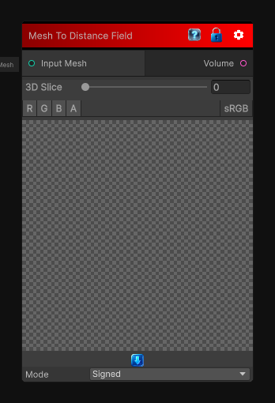

# Mesh To Distance Field

> This file is auto-generated by `Documentation/Generate-GenesisNodeDocs.ps1`.

[Back to index](../../README.md) | [Back to Mesh](../../mesh.md)

## Snapshot

## Details

- Menu: `Mesh/Mesh To Volume`
- Source: [Runtime/Nodes/Mesh/MeshToVolumeNode.cs](../../../../Runtime/Nodes/Mesh/MeshToVolumeNode.cs)

## Documentation

Transform a Mesh into a distance field. The distance field can be either signed or unsigned depending on the mode.

Note that the unsigned distance field is faster to compute.
