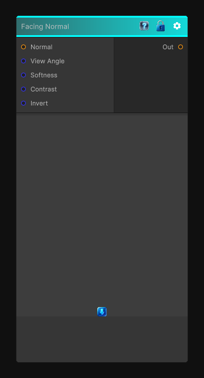

# Facing Normal

> This file is auto-generated by `Documentation/Generate-GenesisNodeDocs.ps1`.

[Back to index](../../README.md) | [Back to Normal](../../normal.md)

## Snapshot

## Details

- Menu: `Normal/Facing Normal`
- Node group: `Normal`
- Shader: `Hidden/Genesis/FacingNormal`
- Source: [Runtime/Nodes/Normals/FacingNormalNode.cs](../../../../Runtime/Nodes/Normals/FacingNormalNode.cs)

## Documentation

Facing Normal node is one of those deceptively simple utility nodes.   It outputs a grayscale mask based on how much a surface's normal faces a given view direction (usually the camera or a user-defined vector).
It's basically:
mask = saturate( dot(normal, viewDir) )
With optional:
- Bias / Contrast
- Invert
- Custom view direction
- Softness shaping
