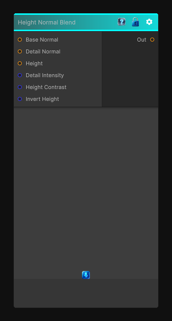

# Height Normal Blend

> This file is auto-generated by `Documentation/Generate-GenesisNodeDocs.ps1`.

[Back to index](../../README.md) | [Back to Normal](../../normal.md)

## Snapshot

## Details

- Menu: `Normal/Height Normal Blend`
- Node group: `Normal`
- Shader: `Hidden/Genesis/HeightNormalBlender`
- Source: [Runtime/Nodes/Normals/HeightNormalBlendNode.cs](../../../../Runtime/Nodes/Normals/HeightNormalBlendNode.cs)

## Documentation

Height Normal Blender is one of those deceptively simple but absolutely essential utility nodes. It blends:
- A base normal map
- A detail normal map
- A height map that modulates how strongly the detail normal contributes
It's basically a height-aware normal blend, not just a linear lerp.
