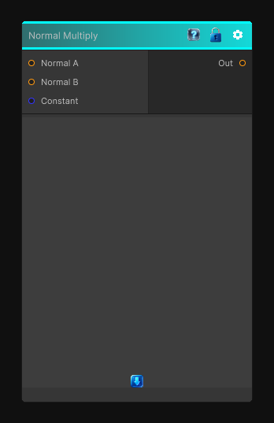

# Normal Multiply

> This file is auto-generated by `Documentation/Generate-GenesisNodeDocs.ps1`.

[Back to index](../../README.md) | [Back to Normal](../../normal.md)

## Snapshot

## Details

- Menu: `Normal/Normal Multiply`
- Node group: `Normal`
- Shader: `Hidden/Genesis/NormalMultiply`
- Source: [Runtime/Nodes/Normals/NormalMultiplyNode.cs](../../../../Runtime/Nodes/Normals/NormalMultiplyNode.cs)

## Documentation

Multiplies a normal by another normal and/or a constant
