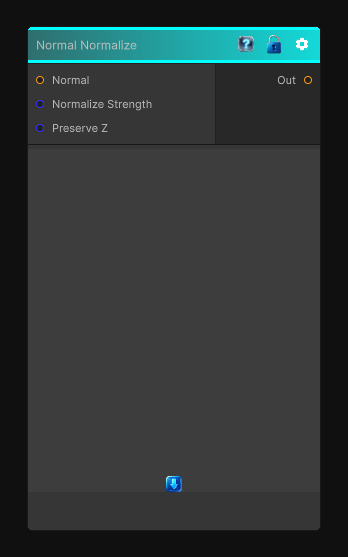

# Normal Normalize

> This file is auto-generated by `Documentation/Generate-GenesisNodeDocs.ps1`.

[Back to index](../../README.md) | [Back to Normal](../../normal.md)

## Snapshot

## Details

- Menu: `Normal/Normal Normalize`
- Node group: `Normal`
- Shader: `Hidden/Genesis/NormalNormalize`
- Source: [Runtime/Nodes/Normals/NormalNormalizeNode.cs](../../../../Runtime/Nodes/Normals/NormalNormalizeNode.cs)

## Documentation

Normal Normalize is one of those tiny but essential utility nodes every procedural pipeline needs. It ensures that any incoming normal map (even if modified, blended, warped, or partially invalid) is re-normalized back into a proper tangent-space unit vector.
This is especially important after:
- Height-based blends
- Vector warps
- Curvature modulation
- Manual channel edits
- Procedural normal generation
A proper normalize step prevents shading artifacts and keeps downstream nodes stable.
