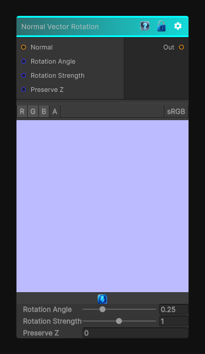

# Normal Vector Rotation

> This file is auto-generated by `Documentation/Generate-GenesisNodeDocs.ps1`.

[Back to index](../../README.md) | [Back to Normal](../../normal.md)

## Snapshot

## Details

- Menu: `Normal/Normal Vector Rotation`
- Node group: `Normal`
- Shader: `Hidden/Genesis/NormalVectorRotation`
- Source: [Runtime/Nodes/Normals/NormalVectorRotationNode.cs](../../../../Runtime/Nodes/Normals/NormalVectorRotationNode.cs)

## Documentation

Normal Vector Rotation is a fantastic utility node - it lets you rotate a tangent-space normal map by an arbitrary angle, which is incredibly useful for:
- Rotating detail normals
- Aligning normals to flow maps
- Procedural anisotropy
- Stylized shading
- Direction-driven normal variation
