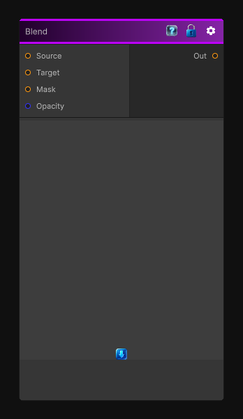

# Blend

> This file is auto-generated by `Documentation/Generate-GenesisNodeDocs.ps1`.

[Back to index](../../README.md) | [Back to Operations](../../operations.md)

## Snapshot

## Details

- Menu: `Operations/Blend`
- Node group: `Operations`
- Shader: `Hidden/Genesis/Blend`
- Source: [Runtime/Nodes/Operations/BlendNode.cs](../../../../Runtime/Nodes/Operations/BlendNode.cs)

## Documentation

Blend between two textures, you can use different blend mode depending which texture you want to blend (depth, color, ect.).

You also have the possibility to provide a mask texture that will affect the opacity of the blend depending on the mask value.
The Mask Mode property is used to select which channel you want the mask value to use for the blending operation.

Note that for normal blending, please use the Normal Blend node.
