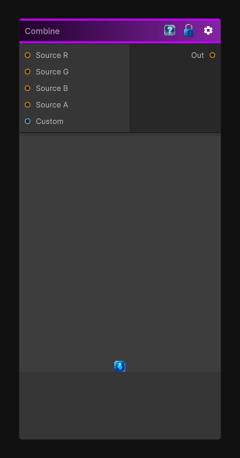

# Combine

> This file is auto-generated by `Documentation/Generate-GenesisNodeDocs.ps1`.

[Back to index](../../README.md) | [Back to Operations](../../operations.md)

## Snapshot

## Details

- Menu: `Operations/Channel Combine`
- Node group: `Operations`
- Shader: `Hidden/Genesis/Combine`
- Source: [Runtime/Nodes/Operations/ChannelCombineNode.cs](../../../../Runtime/Nodes/Operations/ChannelCombineNode.cs)

## Documentation

Combine up to 4 textures into one, allowing you to choose which channel to write in the output texture.

Note that for creating HDRP Mask and Detail maps, there are dedicated nodes.
