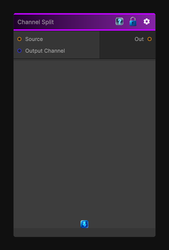

# Channel Split

> This file is auto-generated by `Documentation/Generate-GenesisNodeDocs.ps1`.

[Back to index](../../README.md) | [Back to Operations](../../operations.md)

## Snapshot

## Details

- Menu: `Operations/Channel Split`
- Node group: `Operations`
- Shader: `Hidden/Genesis/Split`
- Source: [Runtime/Nodes/Operations/ChannelSplitNode.cs](../../../../Runtime/Nodes/Operations/ChannelSplitNode.cs)

## Documentation

Return the R, G, B or A channel from an input
