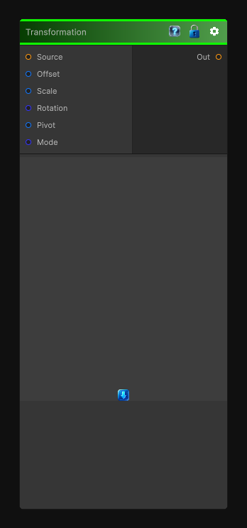

# Transformation

> This file is auto-generated by `Documentation/Generate-GenesisNodeDocs.ps1`.

[Back to index](../../README.md) | [Back to Operations](../../operations.md)

## Snapshot

## Details

- Menu: `Operations/Transformation 2D`
- Node group: `Transforms`
- Shader: `Hidden/Genesis/Transform2D`
- Source: [Runtime/Nodes/Transforms/Transformation2DNode.cs](../../../../Runtime/Nodes/Transforms/Transformation2DNode.cs)

## Documentation

Translation

Rotation

Uniform / non-uniform scale

Pivot control

Optional tiling or clamping

CRT-safe 2D/3D/Cube behavior

Deterministic, sampler-free UV math
