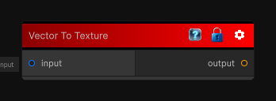

# Vector To Texture

> This file is auto-generated by `Documentation/Generate-GenesisNodeDocs.ps1`.

[Back to index](../../README.md) | [Back to Operations](../../operations.md)

## Snapshot

## Details

- Menu: `Operations/Vector To Texture`
- Source: [Runtime/Nodes/Operations/VectorToTexture.cs](../../../../Runtime/Nodes/Operations/VectorToTexture.cs)

## Documentation

Converts vector data into a texture representation.
