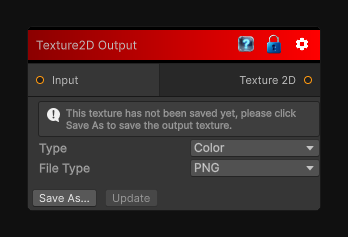

# Texture2D Output

> This file is auto-generated by `Documentation/Generate-GenesisNodeDocs.ps1`.

[Back to index](../../README.md) | [Back to Output](../../output.md)

## Snapshot

## Details

- Menu: `Output/Texture 2D`
- Source: [Runtime/Nodes/Output/Texture2DOutputNode.cs](../../../../Runtime/Nodes/Output/Texture2DOutputNode.cs)

## Documentation

Writes the graph result to a 2D texture output.
