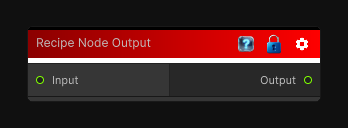

# Recipe Node Output

> This file is auto-generated by `Documentation/Generate-GenesisNodeDocs.ps1`.

[Back to index](../../README.md) | [Back to Recipe](../../recipe.md)

## Snapshot

## Details

- Menu: `Recipe/Recipe Output`
- Node group: `Recipe`
- Source: [Runtime/Nodes/Recipe/RecipeOutputNode.cs](../../../../Runtime/Nodes/Recipe/RecipeOutputNode.cs)

## Documentation

Declares an output for a reusable recipe graph.
