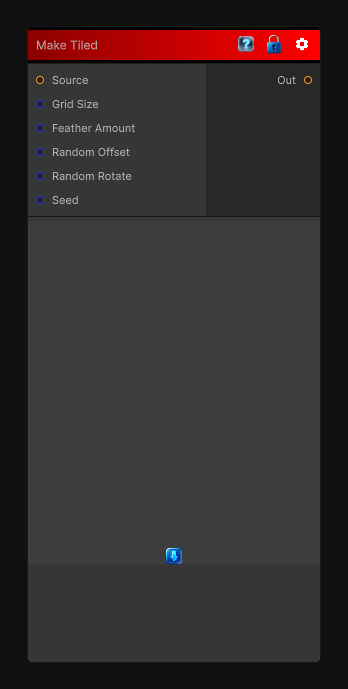

# Make Tiled

> This file is auto-generated by `Documentation/Generate-GenesisNodeDocs.ps1`.

[Back to index](../../README.md) | [Back to Tiling](../../tiling.md)

## Snapshot

## Details

- Menu: `Tiling/Make Tiled`
- Node group: `Tiling`
- Shader: `Hidden/Genesis/MakeItTilePatch`
- Source: [Runtime/Nodes/Tiling/MakeTiledNode.cs](../../../../Runtime/Nodes/Tiling/MakeTiledNode.cs)

## Documentation

It works by:
- Cutting the input into patches
- Offsetting them in a grid
- Blending the seams using feathering
- Optionally randomizing rotation/flip
- Producing a perfectly tileable output
- Patch grid (NxN)
- Random offsets per patch
- Optional rotation/flip
- Seam feathering
- Deterministic sampling
- CRT-safe, no derivatives
