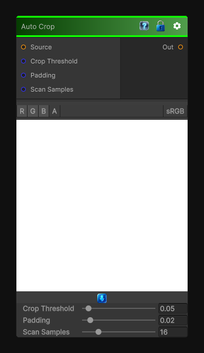

# Auto Crop

> This file is auto-generated by `Documentation/Generate-GenesisNodeDocs.ps1`.

[Back to index](../../README.md) | [Back to Transform](../../transform.md)

## Snapshot

## Details

- Menu: `Transform/Auto Crop`
- Node group: `Transforms`
- Shader: `Hidden/Genesis/AutoCrop`
- Source: [Runtime/Nodes/Transforms/AutoCropNode.cs](../../../../Runtime/Nodes/Transforms/AutoCropNode.cs)

## Documentation

It analyzes the non-empty region of an image (usually based on luminance or alpha), finds the tightest bounding box, and then crops + rescales the result back to full UV space.
