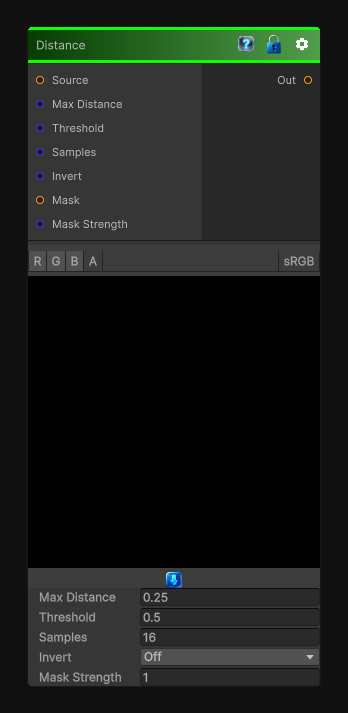

# Distance

> This file is auto-generated by `Documentation/Generate-GenesisNodeDocs.ps1`.

[Back to index](../../README.md) | [Back to Transform](../../transform.md)

## Snapshot

## Details

- Menu: `Transform/Distance`
- Node group: `Transforms`
- Shader: `Hidden/Genesis/DistanceTransform`
- Source: [Runtime/Nodes/Transforms/DistanceNode.cs](../../../../Runtime/Nodes/Transforms/DistanceNode.cs)

## Documentation

Substance's Distance node supports:
Euclidean distance
Adjustable max distance
Inversion
Works on grayscale masks
Produces smooth falloff fields
