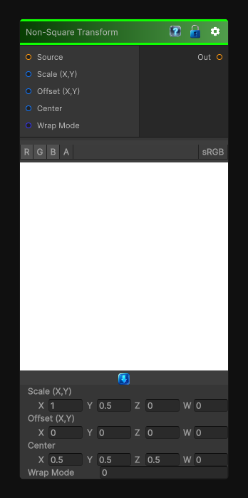

# Non-Square Transform

> This file is auto-generated by `Documentation/Generate-GenesisNodeDocs.ps1`.

[Back to index](../../README.md) | [Back to Transform](../../transform.md)

## Snapshot

## Details

- Menu: `Transform/Non-Square Transform`
- Node group: `Transforms`
- Shader: `Hidden/Genesis/NonSquareTransform`
- Source: [Runtime/Nodes/Transforms/NonSquareTransformNode.cs](../../../../Runtime/Nodes/Transforms/NonSquareTransformNode.cs)

## Documentation

- Remap a non-square texture into square UV space
- Stretch or compress X/Y independently
- Maintain aspect ratio or override it
- Recenter the transformed region
- Use it as a pre-warp for polar, kaleidoscope, shape, or pattern nodes
In Genesis, this node is used constantly for:
- Converting rectangular photos into square procedural space
- Preparing masks for polar transforms
- Fixing aspect-ratio distortions
- Making procedural shapes uniform
- Pre-warping noise
