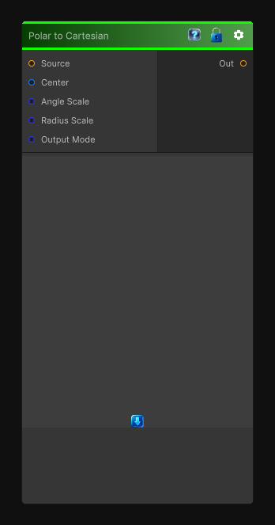

# Polar to Cartesian

> This file is auto-generated by `Documentation/Generate-GenesisNodeDocs.ps1`.

[Back to index](../../README.md) | [Back to Transform](../../transform.md)

## Snapshot

## Details

- Menu: `Transform/Polar to Cartesian`
- Node group: `Transforms`
- Shader: `Hidden/Genesis/PolarToCartesian`
- Source: [Runtime/Nodes/Transforms/PolarToCartesianNode.cs](../../../../Runtime/Nodes/Transforms/PolarToCartesianNode.cs)

## Documentation

Polar -> Cartesian is the perfect companion to your Cartesian -> Polar node. Together they form a complete bidirectional coordinate-space toolkit - essential for:
- Undoing polar warps
- Reconstructing circular patterns
- Building kaleidoscopes
- Radial -> planar mapping
- Procedural shape generation
- Reversing Genesis's Polar Transform
