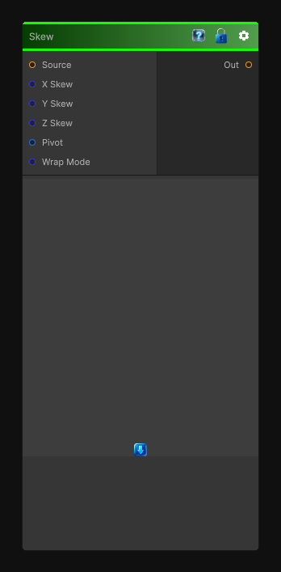

# Skew

> This file is auto-generated by `Documentation/Generate-GenesisNodeDocs.ps1`.

[Back to index](../../README.md) | [Back to Transform](../../transform.md)

## Snapshot

## Details

- Menu: `Transform/Skew`
- Node group: `Transforms`
- Shader: `Hidden/Genesis/Skew`
- Source: [Runtime/Nodes/Transforms/SkewNode.cs](../../../../Runtime/Nodes/Transforms/SkewNode.cs)

## Documentation

- Slanted patterns
- Perspective-like shears
- Stylized distortions
- Pre-warping shapes before rotation or polar transforms
- Creating italicized or slanted procedural elements
A proper Skew node lets you shear UVs along X or Y, with:
