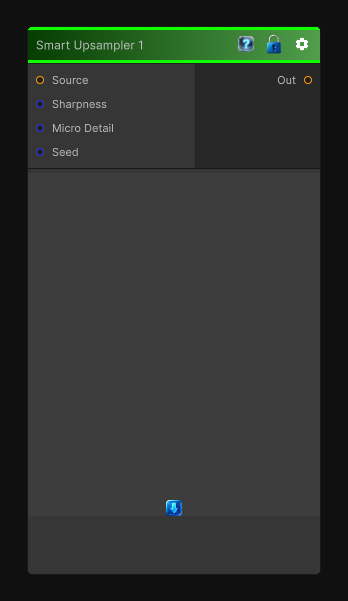

# Smart Upsampler 1

> This file is auto-generated by `Documentation/Generate-GenesisNodeDocs.ps1`.

[Back to index](../../README.md) | [Back to Transform](../../transform.md)

## Snapshot

## Details

- Menu: `Transform/Smart Upsampler 1`
- Node group: `Transforms`
- Shader: `Hidden/Genesis/NoiseUpscale1`
- Source: [Runtime/Nodes/Transforms/SmartUpsampler1Node.cs](../../../../Runtime/Nodes/Transforms/SmartUpsampler1Node.cs)

## Documentation

Smart Upsampler 1 takes a low-resolution noise and reconstructs a higher-resolution version that preserves the character of the original while adding subtle detail. It's not just bilinear or bicubic; it's a content-aware upscale that:
- Reconstructs sharper edges
- Preserves noise structure
- Adds micro-detail
- Avoids blur and ringing
- Works for grayscale or color
