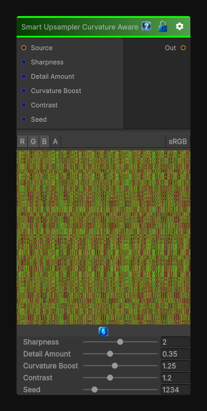

# Smart Upsampler Curvature Aware

> This file is auto-generated by `Documentation/Generate-GenesisNodeDocs.ps1`.

[Back to index](../../README.md) | [Back to Transform](../../transform.md)

## Snapshot

## Details

- Menu: `Transform/Smart Upsampler Curvature Aware`
- Node group: `Transforms`
- Shader: `Hidden/Genesis/NoiseUpscale3_CurvatureAware`
- Source: [Runtime/Nodes/Transforms/SmartUpsamplerCurvatureAwareNode.cs](../../../../Runtime/Nodes/Transforms/SmartUpsamplerCurvatureAwareNode.cs)

## Documentation

Curvature-Aware Noise Upscale 3 is the smartest member of the upscale family - it doesn't just preserve edges, it understands surface curvature and adapts the reconstruction accordingly.
Curvature-aware upscaling gives you:
- Edge preservation
- Curvature-driven sharpening
- Detail suppression in concave areas
- Detail enhancement on convex ridges
- Zero ringing, fully CRT-safe
