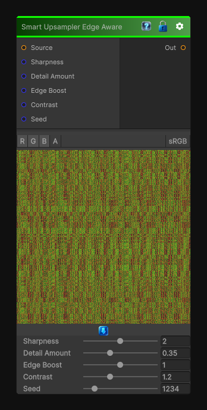

# Smart Upsampler Edge Aware

> This file is auto-generated by `Documentation/Generate-GenesisNodeDocs.ps1`.

[Back to index](../../README.md) | [Back to Transform](../../transform.md)

## Snapshot

## Details

- Menu: `Transform/Smart Upsampler Edge Aware`
- Node group: `Transforms`
- Shader: `Hidden/Genesis/NoiseUpscale3_EdgeAware`
- Source: [Runtime/Nodes/Transforms/NoiseUpsamplerEdgeAwareNode.cs](../../../../Runtime/Nodes/Transforms/NoiseUpsamplerEdgeAwareNode.cs)

## Documentation

- Preserves edges
- Avoids blurring silhouettes
- Sharpens structure instead of smearing it
- Adds high-frequency detail only where appropriate
- Uses local gradient magnitude to guide reconstruction
This is the perfect companion to your Upscale 1/2/3 family - and it's exactly the kind of node that makes procedural noise feel hand-crafted.
