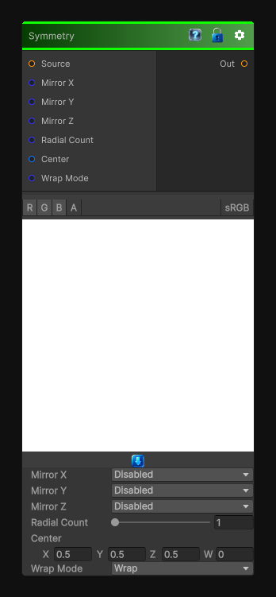

# Symmetry

> This file is auto-generated by `Documentation/Generate-GenesisNodeDocs.ps1`.

[Back to index](../../README.md) | [Back to Transform](../../transform.md)

## Snapshot

## Details

- Menu: `Transform/Symmetry`
- Node group: `Transforms`
- Shader: `Hidden/Genesis/Symmetry`
- Source: [Runtime/Nodes/Transforms/SymmetryNode.cs](../../../../Runtime/Nodes/Transforms/SymmetryNode.cs)

## Documentation

Symmetry is one of those foundational procedural tools - the kind of node that quietly powers half of Genesis's shape, pattern, and kaleidoscope workflows. A proper symmetry node should let you:
- Mirror across X, Y, or both
- Choose symmetry count (2-way, 4-way, 6-way, etc.)
- Choose pivot/center
- Wrap or clamp
- Deterministic, CRT-safe
- Works for 2D / 3D / Cube textures
