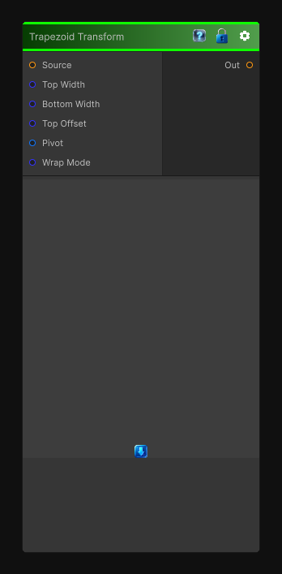

# Trapezoid Transform

> This file is auto-generated by `Documentation/Generate-GenesisNodeDocs.ps1`.

[Back to index](../../README.md) | [Back to Transform](../../transform.md)

## Snapshot

## Details

- Menu: `Transform/Trapezoid Transform`
- Node group: `Transforms`
- Shader: `Hidden/Genesis/TrapezoidTransform`
- Source: [Runtime/Nodes/Transforms/TrapezoidTransformNode.cs](../../../../Runtime/Nodes/Transforms/TrapezoidTransformNode.cs)

## Documentation

Trapezoid Transform is the missing sibling of Quad Transform - a controlled, parameter-driven way to skew a rectangle into a trapezoid without manually setting four corner points. It's perfect for:
- Faux-perspective
- UI slanting
- Book/page-like distortions
- Stylized projection
- Pre-warping before polar or kaleidoscope nodes
- Turning rectangles into tapered shapes
A proper Trapezoid Transform node should give you:
- Independent top and bottom width
- Optional vertical taper
- Pivot control
- Wrap/clamp
- Deterministic, CRT-safe
- Works for 2D / 3D / Cube textures
