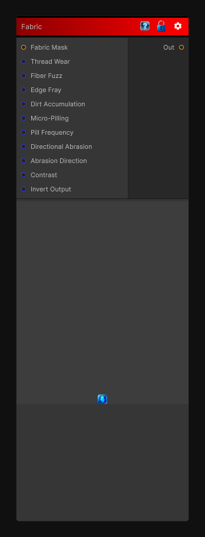

# Fabric

> This file is auto-generated by `Documentation/Generate-GenesisNodeDocs.ps1`.

[Back to index](../../README.md) | [Back to Wear](../../wear.md)

## Snapshot

## Details

- Menu: `Wear/Fabric`
- Node group: `Wear`
- Shader: `Hidden/Genesis/FabricWeathering`
- Source: [Runtime/Nodes/Wear/FabricWearNode.cs](../../../../Runtime/Nodes/Wear/FabricWearNode.cs)

## Documentation

Dedicated fabric-specific wear model that simulates:
- Fiber fuzzing
- Thread thinning
- Edge fray
- Dirt accumulation
- Wear along weave direction
- Micro-pilling
- High-frequency fiber breakup
- Directional abrasion
