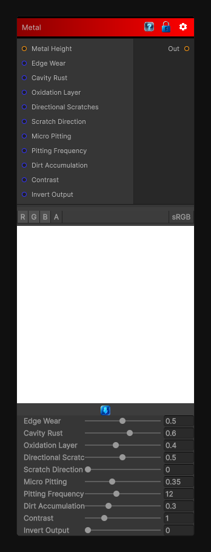

# Metal

> This file is auto-generated by `Documentation/Generate-GenesisNodeDocs.ps1`.

[Back to index](../../README.md) | [Back to Wear](../../wear.md)

## Snapshot

## Details

- Menu: `Wear/Metal`
- Node group: `Wear`
- Shader: `Hidden/Genesis/MetalWeathering`
- Source: [Runtime/Nodes/Wear/MetalWearNode.cs](../../../../Runtime/Nodes/Wear/MetalWearNode.cs)

## Documentation

Metal ages in ways that are completely different from fabric, leather, or stone. It develops:
- Edge wear / brightening
- Cavity rust
- Oxidation layers
- Pitting and micro-corrosion
- Directional scratches
- Oil/dirt accumulation
- Heat tinting (optional)
Genesis achieves this through curvature, cavity detection, micro-noise, and directional abrasion.
