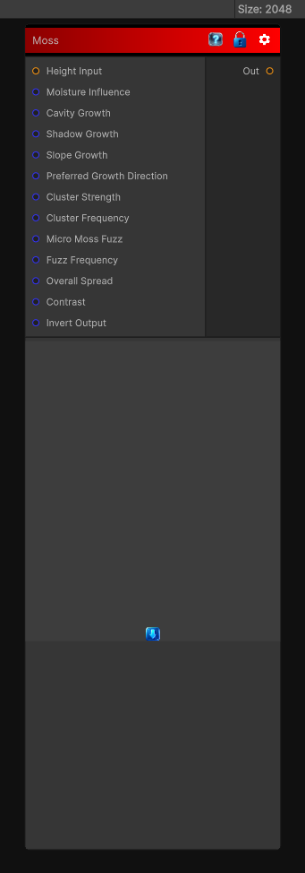

# Moss

> This file is auto-generated by `Documentation/Generate-GenesisNodeDocs.ps1`.

[Back to index](../../README.md) | [Back to Wear](../../wear.md)

## Snapshot

## Details

- Menu: `Wear/Moss`
- Node group: `Wear`
- Shader: `Hidden/Genesis/MossWeathering`
- Source: [Runtime/Nodes/Wear/MossWearNode.cs](../../../../Runtime/Nodes/Wear/MossWearNode.cs)

## Documentation

- Moisture retention
- Shadowed / occluded areas
- Surface roughness
- Crevices and cavities
- North-facing slopes
- Ambient humidity
- Random organic clustering
